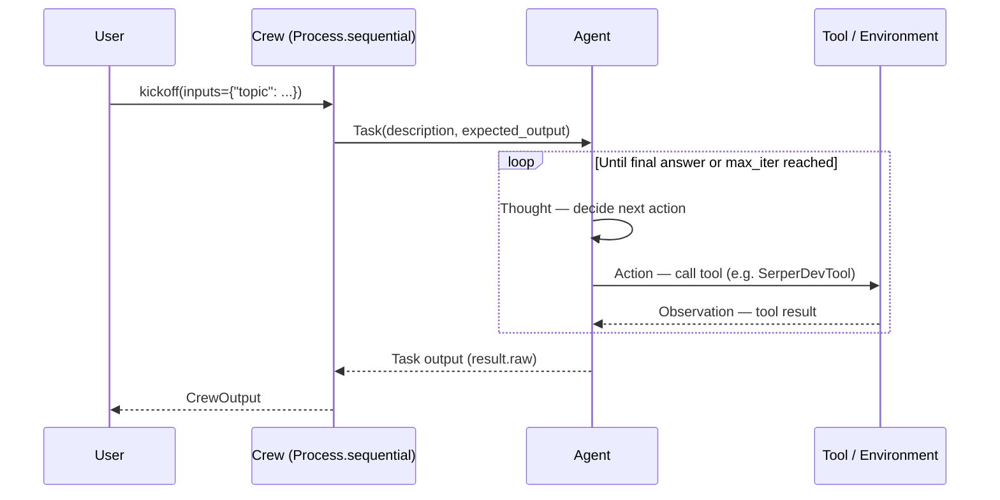

# Project Title: [Name of Your AI Agent]

**Course:** Aktuelle Fallstudien der Digitalökonomie und der Künstlichen Intelligenz: Generative und Agentische KI
**Team Name:** [Your Team Name]

> **What this document is:** your team's shared design record — architecture, implementation choices, evaluation, theory — built up sprint by sprint. It's graded directly as your team's **Project Report (40%)** — see [Assignment Overview](team_assignment/en/assignment-overview.md#grading). Your team's implementation is also graded, separately, as **Code (10%, team-wide)** — either your `src/` code or reworked exercise notebooks with your own topic, judged from your commit/PR history. Section 7 (Ethical Considerations) is the one exception to "shared team content": it's kept here only as a reference outline — each student fills in and hands in their **own individually-graded copy** (20%) separately, see the note in that section.

## Team Members

- [Student 1 Name] ([GitHub Username])
- [Student 2 Name] ([GitHub Username])
- [Student 3 Name] ([GitHub Username])
- [Student 4 Name] ([GitHub Username])

---

## Sprint Progression

_(Fill in one row per sprint, right after that sprint's PR — not retroactively at the end. A sprint's PR is your team's design progress on that layer, captured in this document; implementing it in `src/` counts toward your grade too, see the note above, though it doesn't have to be complete at every sprint. This table is the throughline; the rest of this report describes the final state — where you land after Sprint 4 — in depth.)_

| Sprint | Added | What changed, concretely — and one surprise |
| --- | --- | --- |
| 0 — Steps 00–01 | Environment setup, first plain `crewai.LLM` call | |
| 1 — Steps 02–07 | Baseline zero-shot prompt, then prompting techniques | Accuracy already with one prompt surprised me |
| 2 — Steps 08–09 *(interim)* | CrewAI itself, first `Agent` | |
| 3 — Steps 10–13 | Memory, Tools, MCP, RAG | |
| 4 — Step 14 *(final)* | Second agent, `Process` | |

---

## 1. Executive Summary

_(**Purpose:** To provide a high-level, managerial overview. Motivate your solution.)_

_(Write a concise summary (approx. 250-400 words) for a non-technical stakeholder. Answer the following:_

- _What specific problem or business need does your agent address?_
- _What is your solution? Describe the agent's main function in one or two sentences on an abstract level._
- _What is the key capability or "magic" of your system? (e.g., "It autonomously analyzes customer support tickets and routes them to the correct department with a summarized solution.")_
- _What is the potential value or impact of this agent? (e.g., "This system can reduce manual sorting time by 90%...")_

---

## 2. Introduction & Problem Statement

_(**Purpose:** To define the context and goals of your project.)_

- **Problem:** Describe the problem you are solving in detail. Who faces this problem? Why is it difficult? What are the limitations of existing solutions? Why does an agentic AI approach hold potential to solve this problem compared to other (non-agentic) approaches (it is key to address this question).
- **Objectives:** What are the specific, measurable goals of your agent? (e.g., "The agent must successfully achieve 8/10 tasks," or "The agent must be able to book a meeting by finding a common free slot in two calendars.")
- **Scope:** What _does_ your agent do, and just as importantly, what _doesn't_ it do? Define the boundaries of your project.

---

## 3. System Architecture

_(**Purpose:** To explain the high-level design of your agent.)_

_(Provide a high-level diagram of your agent's architecture. You can create this in a tool like draw.io and embed it as a .png/.jpg, or write it as a [Mermaid](https://mermaid.js.org/syntax/sequenceDiagram.html) diagram in a code fence — GitHub renders Mermaid natively, no export needed. A sequence diagram works well for showing the request/response flow between the user, your `Crew`, and any tools/environment it calls; a flowchart works better if you want to show multiple agents and how work moves between them.)_

``

_(Example — replace with your own agent's actual flow, not this one:)_

With a second agent and `context=[...]` chaining (Step 14), add another `Agent` lane and a second `Crew->>Agent` / `Agent-->>Crew` pair after the first, showing the first task's output feeding the second task's description. With `process=Process.hierarchical` (Step 15), add a `Manager` participant between `Crew` and the agents, delegating each task at runtime instead of `Crew` calling a fixed `Agent` directly.

_(Explain the diagram and the overall workflow:_

- _What are the main components? (e.g., Agents, Tasks, Process, Tool/MCP Layer, Memory).)_
- _How does data flow through the system? Start with a user input (or the `topic`/inputs passed to `crew.kickoff()`) and trace its path._
- _This is the most important place to describe your `Crew`. What are your `Agent`s (`role`/`goal`/`backstory`)? What `Task`s are they assigned, and how do they chain together (`context=[...]`)? What `Process` do you use — `sequential` or `hierarchical` — and why? If you wrote a reusable class (see `src/research_crew/agents/base.py`'s `BaseAgent` for an example) or a custom tool/MCP integration, describe that structure too.)_

- **Design Pattern Choice:** [Step 16](exercises/step_16_design_patterns.ipynb) covers seven recurring workflow patterns — prompt chaining, chain of thought, tree of thought, routing, parallelization, orchestrator-workers, evaluator-optimizer. Name which one(s) your architecture actually uses, and justify **each one individually**, not as a group:
  - Which CrewAI mechanism implements it in your code (e.g. `Task(context=[...])`, `Agent(reasoning=True)`, `ConditionalTask`, `Task(async_execution=True)`, `Process.hierarchical`, `Task(guardrail=...)`)?
  - Why this pattern over the simplest alternative — what would break, or measurably get worse, without it? ("It seemed more sophisticated" is not a justification.)
  - If you use **none** of the seven, say so explicitly and explain why a single `Task`/`Agent` was enough — that's a legitimate, gradeable answer, not a gap. This is a narrower, implementation-level version of the suitability question Section 5.1 asks about the project as a whole.

---

## 4. Implementation Details

_(**Purpose:** To detail the "how" of your project, covering the specific technical choices.)_

### 4.1. LLM Selection & Configuration

- **Models Used:** Which LLM(s) did you use? (e.g., `gemini/gemini-3.1-flash-lite`, `gpt-4o-mini`).
- **Justification:** _Why_ did you choose these models? Discuss your reasoning based on:
  - Performance (quality of responses for your task)
  - Speed (latency)
  - Cost (API costs vs. free-tier models)
  - Context window size
  - Accessibility (e.g., "We used Gemini's free tier for development to avoid API costs, and switched to OpenAI for the final run due to better tool-calling reliability.")
- **Hyperparameters:** What settings did you use (e.g., `temperature`, `max_tokens`)? Explain your choices.
  - _(e.g., "We set `temperature=0.1` on our Researcher agent for factual, tool-grounded answers, and `temperature=0.7` on our Analyst agent so its final report reads more naturally.")_

### 4.2. Key Components (Memory, Tools)

- **Tools:** List and describe each tool (also MCP servers) you defined for your agent.
  - _(e.g., `SerperDevTool()`: live web search. A custom MCP server exposing `fetch_invoice(id: str) -> dict`.)_
- **Memory:** What kind of memory does your agent have?
  - _(e.g., "We enabled CrewAI's built-in `memory=True` on our `Crew`, giving our agent short-term recall of recent interactions via semantic retrieval — see [Step 08](exercises/step_08_intro_to_crewai.ipynb) for how this works under the hood." Or: "We manually folded a growing transcript into each `Task`'s description, giving the agent context across turns without relying on CrewAI's built-in memory system.")_
  - _(Or, "We implemented RAG via `knowledge_sources`. We used a `TextFileKnowledgeSource` pointed at our own document, and the `Crew`'s `embedder` retrieves the relevant chunks automatically — see [Step 13](exercises/step_13_rag.ipynb).")_

### 4.3. Prompt Engineering

_(This is a critical section. Show your work.)_

- **Agent Identity:** Include your final `role`/`goal`/`backstory` for each agent here. Explain why you wrote them this way (persona, rules, scope of responsibility) — the same components you experimented with as `persona`/`instruction`/`context`/`audience`/`tone` in [Step 04](exercises/step_04_prompt_template.ipynb).
- **Prompting Techniques:** Explain how you used concepts from the exercise steps in your prompts or agent design.
  - **Few-Shot / Chain Prompting:** Did you embed examples in a `backstory` ([Step 03](exercises/step_03_few_shot.ipynb)), or split a task into multiple chained `Task`s via `context=[...]` ([Step 05](exercises/step_05_chain_prompting.ipynb), [Step 14](exercises/step_14_multi_agent_seq.ipynb))?
  - **Chain of Thought (CoT):** Did you instruct an agent to "think step by step" in its `backstory`/`Task.description` ([Step 06](exercises/step_06_chain_of_thought.ipynb)), or use CrewAI's own `reasoning=True` plan-and-refine feature ([Step 16](exercises/step_16_design_patterns.ipynb) Pattern 2)? Show where. How did this change the verbose log or the final answer?
  - **ReAct (Reasoning and Acting):** Every CrewAI `Agent` follows the ReAct loop internally by default ([Step 09](exercises/step_09_single_agent.ipynb)) — pull a snippet from your own verbose log showing a Thought → Action → Observation cycle, and explain what triggered it (e.g., a tool call).
  - **Tree of Thought (ToT):** [Step 07](exercises/step_07_tree_of_thought.ipynb) simulates it via a single prompt asking one model to role-play multiple experts; [Step 16](exercises/step_16_design_patterns.ipynb) Pattern 3 rebuilds it properly with genuinely separate, parallel `Agent`s and a judge `Task`. Did you implement anything like this — which version, and why?
- **Prompt Evolution:** How did your agents' `backstory`/`Task` descriptions change, specifically — what did you add to fix a failure or sharpen behavior?

  Sprint 1 is purely about this — no agent exists yet — so recap it here before the story shifts to agent architecture in Section 3:

  | Sprint | Prompting technique | What changed, concretely |
  | --- | --- | --- |
  | 1 — Step 02 | None (zero-shot baseline) | |
  | 1 — Steps 03–07 | Few-shot / template / chaining / CoT / ToT | |

  The full five-sprint arc — including where agents take over — is in the **Sprint Progression** table at the top of this report.

### 4.4. Context Engineering

_(**Purpose:** To explain how you manage and structure the context that your agent uses to make decisions.)_

- **Context Structure:** How do you organize and structure the context passed to your LLM at each step? What information ends up in an agent's prompt?
  - _(e.g., "Each `Task.description` is a fixed template: [role reminder] + [prior task's output, via `context=[...]`] + [the current question]. CrewAI assembles the rest — `role`/`goal`/`backstory` as the system message — automatically.")_
- **Context Window Management:** How do you handle context window limits? Do you truncate, summarize, or prioritize certain information?
  - _(e.g., "For our multi-turn `BaseAgent` subclass, we cap the transcript we fold into each `Task.description` at the last 5 turns, dropping older ones, to keep the prompt from growing unbounded.")_
- **Context Retrieval:** If you use RAG or `knowledge_sources`, how do you retrieve and rank relevant context?
  - _(e.g., "Our `TextFileKnowledgeSource` is embedded via Gemini and retrieved by CrewAI's own semantic search — we did not need to implement retrieval ourselves, see [Step 13](exercises/step_13_rag.ipynb).")_
- **Context Compression/Summarization:** Do you use any techniques to compress or summarize context to fit more information?
  - _(e.g., "We rely on `Task(context=[...])` passing only the *final output* of a prior task forward, not its full reasoning trail — this is itself a form of compression, discussed in [Step 08](exercises/step_08_intro_to_crewai.ipynb)'s 'What plays the role of state' section.")_
- **Dynamic Context Selection:** Does your agent dynamically select which context to include based on the task?
  - _(e.g., "Our Researcher agent only receives `knowledge_sources` when the question relates to our internal documents; for general questions we omit it to save on embedding calls.")_

---

## 5. Evaluation & Challenges

_(**Purpose:** To critically assess your project through three lenses, not one: was agentic AI even the right approach, does it actually perform, and is it worth anything to the problem you picked? A technically working agent that didn't need to be an agent, or that no one would trust to use, is still a weak evaluation.)_

### 5.1 Suitability: Was Agentic AI the Right Approach?

_(Judge the choice itself, before judging performance. See Anthropic's [Building Effective Agents](https://www.anthropic.com/engineering/building-effective-agents): agentic systems trade latency and cost for flexibility, and most tasks don't need that trade.)_

- **Fit:** Is the task you're addressing genuinely dynamic — variable inputs, context-dependent decisions, exception handling — or fundamentally deterministic? A deterministic task is usually better served by a fixed workflow or rules than an autonomous `Agent`.
  - _(e.g., "Our task requires deciding, case by case, which of three sources to check based on the user's phrasing — that variability is what justifies an Agent over a fixed pipeline.")_
- **Baseline comparison:** What does your agent actually add over the Step 02 zero-shot baseline your team ran at the start of the course? Be specific and honest — "not much" is a valid, gradeable answer if that's genuinely what you found.
- **Alternative considered:** Would a simpler workflow (fixed code path + LLM calls, no autonomous `Agent`) have solved this just as well? Why or why not?

### 5.2 Performance: How Well Does It Actually Work?

_(Ground this in evidence, not impressions. `Crew(tracing=True)`'s dashboard — introduced in [Step 08](exercises/step_08_intro_to_crewai.ipynb) — is your primary evidence source here: it's where you'll actually find *why* a run failed, not just that it did. [Step 17](exercises/step_17_evaluation_harness.ipynb) builds a small, reusable harness that produces the Goal Completion Rate and cost/latency numbers below directly — run it on your own agent and test cases instead of estimating these by hand.)_

- **Testing & Results:** How did you test your agent? What scenarios did you use?
  - Show 2-3 examples of your agent working **well**, each with its `tracing=True` dashboard link. (Include user input and agent output).
  - Show 1-2 examples of your agent **failing** or struggling, each with its trace link. Explain _why_ it failed (e.g., "The agent called the wrong tool," "A knowledge source chunk was retrieved out of context," "The LLM hallucinated a citation") — pull this from the trace's reasoning log, not just the final answer.
- **Goal Completion Rate:** Of the scenarios you tested, what fraction did the agent complete correctly without human intervention? ([Step 17](exercises/step_17_evaluation_harness.ipynb)'s LLM-judge harness gives you this directly.)
- **Cost & latency vs. baseline:** Per `result.token_usage` and wall-clock timing ([Step 17](exercises/step_17_evaluation_harness.ipynb)), how much slower/more expensive is a full agent run than the Step 02 zero-shot call? Is that trade-off justified by the quality difference you observed?
- **Challenges Faced:** What was the hardest part of this project?
  - _(e.g., "Getting `context=[...]` to reliably carry the right information between two agents took several iterations." or "Debugging why our `Crew`'s memory wasn't being recalled across kickoffs was time-consuming.")_
- **Limitations:** What are the known limitations of your final agent?

### 5.3 Business Value: Is It Worth Building?

_(Step outside the code and judge the project the way a stakeholder would, not a developer.)_

- **The bottleneck:** What one, specific process step does your agent actually address? ("Helps with job applications" is too vague; "extracts the specific requirements from one job posting" is not.)
- **Blast radius:** What happens when the agent is wrong? Who bears the consequence, and how costly is a bad *answer* versus a bad *action*? (Related to Section 7's Autonomy & Control question, but framed here in business rather than ethical terms.)
- **Adoption:** Would someone outside your team — the actual target user — trust this output enough to use it without checking every step? What would have to change for that to be true?

---

## 6. Theoretical Foundations: Agentic Characteristics

_(**Purpose:** To connect your practical implementation to the core theory from the lecture.)_

_(Analyze your agent's design and behavior based on Wooldridge's four characteristics of agentic software as well plus learning capabilities as fifth characteristic. Be honest in your assessment.)_

- **Autonomy:** To what extent does your agent operate without direct human intervention? Does it make its own decisions to achieve its goals? Provide examples.
  - _(e.g., "Our Researcher agent exhibits moderate autonomy: it decides for itself when to call `SerperDevTool` and what query to use, without being told. However, it cannot initiate a new task on its own and requires `crew.kickoff()` to start.")_
- **Social Ability:** Does your agent interact with other agents or humans (beyond the initial user)? Did you design any communication protocols?
  - _(e.g., "Our two agents have moderate social ability: the Analyst receives the Researcher's output via `context=[research_task]`, but they don't converse — CrewAI's `Process.sequential` handles the handoff, not agent-to-agent dialogue.")_
- **Reactiveness:** How does your agent perceive its environment and respond to changes? The "environment" could be new user input, new data from a tool (like a web search), or an error.
  - _(e.g., "The agent is highly reactive within its ReAct loop: if `SerperDevTool` returns no useful results, the agent perceives this and reformulates its search query before trying again.")_
- **Proactiveness:** Does your agent exhibit goal-directed behavior? Does it take the initiative rather than just reacting?
  - _(e.g., "The agent shows simple proactiveness: if its first search result is insufficient, it proactively runs a second, more specific search before producing a final answer, rather than answering with weak evidence.")_
- **Continual Learning:** Does your agent learn over time? Can it adapt its behavior based on experience, feedback, or new information? How does it retain and apply learned knowledge?
  - _(e.g., "Our agent does not implement continual learning in the traditional sense — it does not update model weights. It uses CrewAI's `memory=True` short-term memory, which lets it recall facts from earlier `kickoff()` calls within the same agent role, but this is semantic recall, not learning.")_
  - _(Or, "We implemented a feedback loop outside CrewAI: successful `Task` descriptions are saved to a file, and future runs prepend the best-performing phrasing. This is a crude form of learning across sessions, distinct from CrewAI's own memory.")_

---

## 7. Ethical Considerations & Trustworthy AI

> **Individual deliverable — hand in separately, not here.** Unlike every other section in this document, this one isn't filled in as shared team content. Each student writes and submits their **own individually-graded copy** (20% of your grade) via OpenOlat, not via this file and not via GitHub — see the [Ethics Report template](team_assignment/en/ethics-report-template.md) for the actual document to fill in and hand in. What follows below is left as a reference outline only, so the full shape of the report stays visible in one place — do not fill it in here, and do not treat filling it in here as a substitute for your individual submission.

_(**Purpose:** To judge your agent against the EU's framework for trustworthy AI — not just naming risks in the abstract, but reaching a grounded verdict on how trustworthy *this specific agent* is, and proposing concrete changes that would make it more so. See the [Ethics Report template](team_assignment/en/ethics-report-template.md) for the full prompts and the EU HLEG *Ethics Guidelines for Trustworthy AI* citation.)_

_(Each dimension below asks for two things: a grounded reflection on where your agent actually stands, and a specific proposed change or amendment that would improve it. Address the dimensions relevant to your specific agent:)_

- **Bias & Fairness:** Does your agent have the potential to exhibit bias? How might it treat different users or groups differently? What steps did you take (or should be taken) to mitigate bias? What's one concrete change that would reduce this risk?
  - _(e.g., "Our agent uses a language model that may have been trained on biased data. We tested our agent with queries from diverse user personas and monitored for discriminatory outputs. We added explicit instructions in our agents' `backstory` to treat all users fairly.")_
- **Privacy & Data Security:** What data does your agent collect, store, or process? How is user data handled? What privacy concerns arise from your agent's memory or tool usage? What's one concrete change that would improve this?
  - _(e.g., "CrewAI's `memory=True` stores interaction data locally under `CREWAI_STORAGE_DIR`. We reviewed what gets written there and ensured no sensitive information is included. Users can clear it via `crew.reset_memories('all')`.")_
- **Transparency & Explainability:** Can users understand how your agent makes decisions? Is the agent's reasoning process transparent? What happens when the agent makes a mistake? What's one concrete change that would improve this?
  - _(e.g., "Running with `verbose=True` exposes the agent's full ReAct reasoning trail, which we use for debugging. However, end users of our final output only see the final report, not this reasoning.")_
- **Autonomy & Control:** What level of autonomy does your agent have, and what safeguards are in place? Can the agent take actions that have real-world consequences? How can users override or stop the agent? What's one concrete change that would improve this?
  - _(e.g., "Our agent can only read data via tools/`knowledge_sources` — it has no tool that writes to or modifies an external system, so the blast radius of an error is limited to a bad answer, not a bad action.")_
- **Misuse & Safety:** How could your agent be misused? What harmful behaviors could it enable? What safety measures did you implement? What's one concrete change that would improve this?
  - _(e.g., "A web-search-enabled agent could be misused to gather information for harmful purposes. We scoped our Researcher's `goal`/`backstory` narrowly to our topic and did not give it unrestricted search access.")_
- **Accountability:** Who is responsible when the agent makes an error or causes harm? How do you handle errors and edge cases? What's one concrete change that would improve this?
  - _(e.g., "We designed our agents' `expected_output` to include an explicit 'I don't know' path rather than guessing, and we log every `kickoff()`'s `tracing=True` trace URL for after-the-fact review.")_
- **Trustworthiness verdict:** Overall, how trustworthy is this agent as it stands? Which one proposed change above would make the biggest difference, and would you deploy it as-is?

---

## 8. Conclusion & Future Work

- **Conclusion:** Summarize your project's achievements. Did you meet the objectives you set in Section 2? What are your key takeaways from building an AI agent with CrewAI?
- **Future Work:** If you had another month, what would you add or improve?
  - _(e.g., "We would add more tools," "We would move to a YAML-configured `@CrewBase` project like `src/research_crew/`," "We would build a proper user interface.")_

---

## 9. References

_(List any external resources you used. This includes academic papers (like Wooldridge), key blog posts, documentation pages, or libraries. The papers cited across Steps 02–14 of this repo's exercises are a good starting point.)_

- _Wooldridge, M., & Jennings, N. R. (1995). Intelligent agents: Theory and practice. The Knowledge Engineering Review, 10(2), 115–152. https://doi.org/10.1017/S0269888900008122 (Or the specific reference from your lecture)_
- _CrewAI Documentation. https://docs.crewai.com_
- _[Any paper cited in your exercise steps that's directly relevant to your design, e.g. Yao et al. (2022) ReAct, Wu et al. (2023) AutoGen, Lewis et al. (2020) RAG — see each step's "Resources for further reading" section]_

---

## 10. Individual Contribution Log

_(**Crucial for your grade.** While Git history is the main source, please summarize your key contributions here. Be specific.)_

### [Student 1 Name]

- _e.g., Set up the initial Git repository and project structure._
- _e.g., Implemented the `Crew`'s `Task` chaining and `Process` logic (Section 3)._
- _e.g., Wrote Section 3 (Architecture) and 4.1 (LLM Selection) of the report._
- _..._

### [Student 2 Name]

- _e.g., Developed and tested the custom tools/MCP integration (Section 4.2)._
- _e.g., Focused on all prompt engineering and testing (Section 4.3)._
- _e.g., Wrote Section 1 (Exec Summary) and 4.3 (Prompting) of the report._
- _..._

### [Student 3 Name]

- _e.g., Implemented and tuned the memory/RAG component (Section 4.2)._
- _e.g., Conducted all evaluation and testing, documenting results (Section 5)._
- _e.g., Wrote Section 6 (Theoretical Foundations) and 5 (Evaluation) of the report._
- _..._

### [Student 4 Name]

- _e.g., Researched and integrated the alternative LLM provider (Section 4.1)._
- _e.g., Debugged the main agent loop and refactored code for clarity._
- _e.g., Wrote Section 2 (Introduction) and 8 (Conclusion) and managed final report editing._
- _..._
