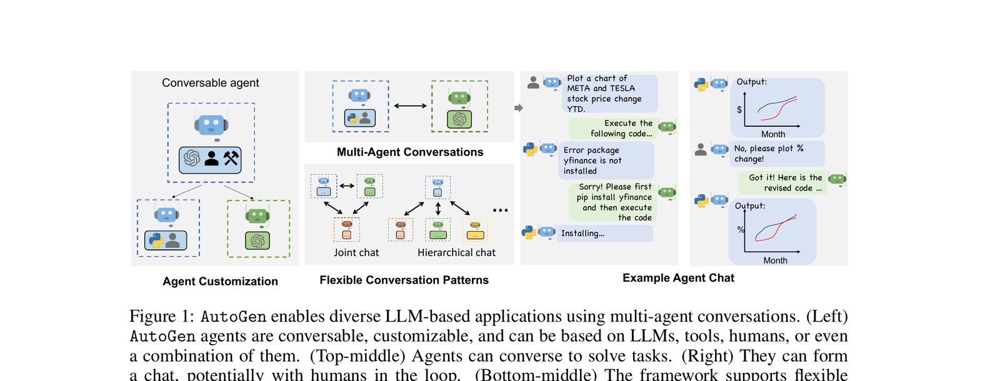

# Schritt 4 — Multi-Agent

🇩🇪 **Deutsch** (diese Seite) · 🇬🇧 [English](../en/04-multi-agent.md)

Fügt einen zweiten Agenten mit einer anderen, ergänzenden Rolle hinzu. Die Ausgabe des ersten Agenten wird über `context:` in `tasks.yaml` an den zweiten weitergegeben. Das ist Multi-Agent im einfachsten Sinne: Rollenspezialisierung mit Task-Verkettung, keine dynamische Delegation.

## Hintergrund

Ein einzelner Agent kann mehrere Dinge tun, aber er kann nicht gleichzeitig zwei wirklich unterschiedliche epistemische Rollen einnehmen — er kann nicht gleichzeitig gutgläubig und skeptisch sein. Zwei Agenten ermöglichen es, diese Spannung in die Architektur einzubauen. Die grundlegende Demonstration von Agenten, die durch Konversation zusammenarbeiten, war:

> Wu, Q., Bansal, G., Zhang, J., Wu, Y., Li, B., Zhu, E., Jiang, L., Zhang, X., Zhang, S., Liu, J., Awadallah, A. H., White, R. W., Burger, D., & Wang, C. (2023). *AutoGen: Enabling Next-Gen LLM Applications via Multi-Agent Conversation*. [arXiv:2308.08155](https://arxiv.org/abs/2308.08155)


*Abbildung 1 aus Wu et al. (2023). Reproduziert für Bildungszwecke in diesem Kurs.*

## In diesem Repo

| Datei | Was ihr ändert |
| --- | --- |
| [src/research_crew/config/agents.yaml](../../src/research_crew/config/agents.yaml) | Fügt einen zweiten Agenten hinzu, der den ersten ergänzt |
| [src/research_crew/config/tasks.yaml](../../src/research_crew/config/tasks.yaml) | Fügt einen zweiten Task hinzu; verknüpft ihn mit `context:` |
| [src/research_crew/crew.py](../../src/research_crew/crew.py) | Fügt eine zweite `@agent`- und `@task`-Methode hinzu |

Das `context:`-Feld in `tasks.yaml` ist der Weg, auf dem der zweite Agent die Ausgabe des ersten erhält:

```yaml
second_task:
  description: ...
  expected_output: ...
  agent: agent_2
  context:
    - first_task
```

## Aufgabe

1. Fügt in `agents.yaml` einen zweiten Agenten hinzu, dessen Rolle sich wirklich von der des ersten unterscheidet — nicht dieselbe Aufgabe mit einem anderen Label.

2. Fügt in `tasks.yaml` einen zweiten Task hinzu, der diesem Agenten zugewiesen ist. Fügt `context: - first_task` hinzu, damit er die Ausgabe des ersten Agenten erhält.

3. Fügt in `crew.py` eine zweite `@agent`- und `@task`-Methode hinzu.

4. Führt es aus — entweder öffnet [step_04_multi_agent.ipynb](../en/step_04_multi_agent.ipynb) (auf Englisch) und führt die Zelle aus, oder im Terminal:
   ```bash
   uv run research_crew
   ```

5. Lest die verbose-Ausgabe beider Agenten. Baut der zweite Agent tatsächlich auf dem ersten auf oder hinterfragt ihn — oder verpackt er denselben Inhalt nur neu? Fühlt sich die finale Ausgabe qualitativ anders an als in Schritt 3?

6. **Experimentiert**: Entfernt die `context:`-Zeile aus dem zweiten Task und führt erneut aus. Was passiert mit der Ausgabe des zweiten Agenten, wenn er die Arbeit des ersten nicht mehr sehen kann?

7. Füllt den **Schritt 4**-Abschnitt in `EVALUATION.md` aus.

## Zusatzaufgabe

Fügt einen dritten Agenten hinzu, dessen Fehlen ihr tatsächlich bemerken würdet — einen Kritiker, einen Übersetzer für ein Laienpublikum oder einen Prüfer. Führt aus und prüft, ob sich die Ausgabe bedeutsam verändert. Falls nicht — warum nicht?
