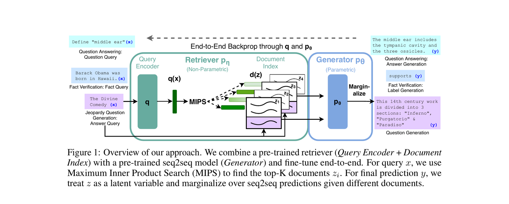

# Sprint 3 — RAG

🇬🇧 **English** (this page) · 🇩🇪 [Deutsch](../de/03-rag.md)

RAG (Retrieval-Augmented Generation) gives an agent access to specific documents/data it wasn't trained on: chunk the content, embed each chunk into a vector, store the vectors, and retrieve the most relevant chunks for a given query to feed into the LLM's context. The part that trips people up: **embeddings are a separate model from the chat LLM** — you can use Groq for chat and a totally different provider for embeddings, or accidentally default to a provider you never configured.

> Lewis, P., Perez, E., Piktus, A., Petroni, F., Karpukhin, V., Goyal, N., Küttler, H., Lewis, M., Yih, W., Rocktäschel, T., Riedel, S., & Kiela, D. (2020). *Retrieval-Augmented Generation for Knowledge-Intensive NLP Tasks*. NeurIPS 2020, 9459–9474. [arXiv:2005.11401](https://arxiv.org/abs/2005.11401)


*Figure 1 from Lewis et al. (2020): a Query Encoder + Retriever feeds documents into a Generator, which marginalizes its prediction over them. Reproduced for educational use in this course.*

## In this repo

[crew.py:48-60](../../src/research_crew/crew.py#L48-L60) already configures the embedder, but doesn't use it yet:

```python
embedder={
    "provider": "google-generativeai",
    "config": {
        "api_key": os.getenv("GEMINI_API_KEY"),
        "model_name": "gemini-embedding-001",
    },
},
```

Why this exists: CrewAI's knowledge/RAG features default to **OpenAI embeddings** regardless of which LLM you configured for chat. Without this block, adding any knowledge source fails with a missing `OPENAI_API_KEY` error.

**Dummy code to reuse:** [src/research_crew/knowledge_source_example.py](../../src/research_crew/knowledge_source_example.py) is a working, unwired `build_knowledge_sources()` helper returning a `TextFileKnowledgeSource`. Copy it in directly, or write the same lines yourself:

```python
from crewai.knowledge.source.text_file_knowledge_source import TextFileKnowledgeSource

preference_knowledge = TextFileKnowledgeSource(file_paths=["your_file.txt"])
```

## Your task

This is the central hands-on sprint of the series — wire up real RAG for your use case:

1. **Sprint planning**: open 1–2 GitHub Issues as user stories labeled `epic:rag`.
2. Pick a real document/source relevant to your use case (see the README's table for ideas per use case) and add it under `knowledge/`.
3. Import a knowledge source class, point it at your file, and pass `knowledge_sources=[...]` into the `Crew` constructor.
4. Add or modify a task that asks something only answerable from that source. Confirm the agent answers correctly using retrieved knowledge.
5. Now remove the knowledge source and run the same question again — does the agent hallucinate, refuse, or admit it doesn't know? That comparison *is* the point of RAG, not a side effect.
6. Update `DESIGN.md`'s Knowledge sources/RAG table.
7. Before calling this done, answer in `DESIGN.md`: what's missing or stale in your source, and what does the agent actually do when retrieval returns nothing relevant? Embeddings have their own rate limits, separate from the chat LLM's — if a classmate uploaded a 100-page document instead of your few pages, would your design still work? Concretely, how is the *output* better with RAG than without it for your specific use case — not "more accurate" in the abstract, but a specific example you can point to?

## Stretch goal

Add a second knowledge source of a different type and confirm both are retrievable.

---

**→ Interim submission is due at the end of this sprint.** Submit: `agents.yaml`, `tasks.yaml`, `DESIGN.md` (Overview, Architecture, Risks, Constraints all reflecting sprints 0–3), and your backlog (Issues + Project board) as they stand. See [Assignment Overview](assignment-overview.md) for exactly what's graded and how.
