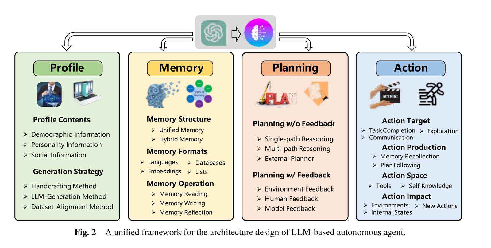

# Step 3 — Single Agent

🇬🇧 **English** (this page) · 🇩🇪 [Deutsch](../de/03-single-agent.md)

Move from a hand-written prompt to a CrewAI `Agent` and `Task`. The `role`, `goal`, and `backstory` you write in `agents.yaml` are still just a system prompt under the hood — CrewAI assembles it for you. What the framework adds is the loop: the agent reasons in steps before producing output, can call tools (step 5), and retries on failure. One agent, one task.

## Background

The core loop that makes an agent an agent — alternating between reasoning about what to do next and taking an action (calling a tool, reading a result, updating a plan) — was introduced in:

> Yao, S., Zhao, J., Yu, D., Du, N., Shafran, I., Narasimhan, K., & Cao, Y. (2022). *ReAct: Synergizing Reasoning and Acting in Language Models*. ICLR 2023. [arXiv:2210.03629](https://arxiv.org/abs/2210.03629)

ReAct (Reason + Act) is the pattern CrewAI agents follow: the model thinks ("I need to find X"), acts (calls a tool), observes the result, thinks again, and repeats until it can produce a final answer. This is what separates an agent from a single prompt call — the loop.

The broader observation that LLM-based agents benefit from an explicit module structure — profile (who the agent is), memory, planning, action — was systematized in:

> Wang, L., Ma, C., Feng, X., Zhang, Z., Yang, H., Zhang, J., Chen, Z., Tang, J., Chen, X., Lin, Y., Zhao, W. X., Wei, Z., & Wen, J. (2023). *A Survey on Large Language Model based Autonomous Agents*. [arXiv:2308.11432](https://arxiv.org/abs/2308.11432)


*Figure 2 from Wang et al. (2023). Reproduced for educational use in this course.*

In CrewAI terms: `role`/`goal`/`backstory` in `agents.yaml` = **Profile**; `tools` + the ReAct task loop = **Action**.

## In this repo

| File | What to change |
| --- | --- |
| [src/research_crew/config/agents.yaml](../../src/research_crew/config/agents.yaml) | Define ONE agent for your topic — role, goal, backstory |
| [src/research_crew/config/tasks.yaml](../../src/research_crew/config/tasks.yaml) | Define ONE task — description, expected_output, agent |
| [src/research_crew/crew.py](../../src/research_crew/crew.py) | Keep only one `@agent` and one `@task` method |
| [step_03_single_agent.ipynb](step_03_single_agent.ipynb) | Run the crew and view the result — nothing to edit here |

The template already has two agents (`researcher` and `analyst`). For this step, reduce it to one — comment out or remove the analyst agent and its task.

## Your task

1. Open `agents.yaml`. Replace the existing agent with your own: give it a `role`, `goal`, and `backstory` suited to your topic.

2. Open `tasks.yaml`. Replace the existing task with one that fits your agent and topic: write a `description` and an `expected_output`.

3. In `crew.py`, keep only one `@agent` and one `@task` method (remove or comment out the analyst).

4. Run it — either open [step_03_single_agent.ipynb](step_03_single_agent.ipynb) and run its cell, or from the terminal:
   ```bash
   uv run research_crew
   ```

5. Read the verbose output — this is the first time you can see the agent's internal reasoning, not just the final answer. Does the agent break the task into sub-steps? Does the output feel different from what step 2 produced?

6. Fill in the **Step 3** section of `EVALUATION.md`.

## Stretch goal

Look at the verbose log's "Final Answer" alongside the agent's intermediate reasoning. Find one place where the reasoning and the conclusion seem inconsistent — where the agent reasons toward one thing and writes something slightly different. What does this tell you about trusting chain-of-thought?

---

**→ Interim submission is due after this step.** Submit the state of `main` after merging `sprint-3`. See [Assignment Overview](assignment-overview.md) for exactly what's expected.
